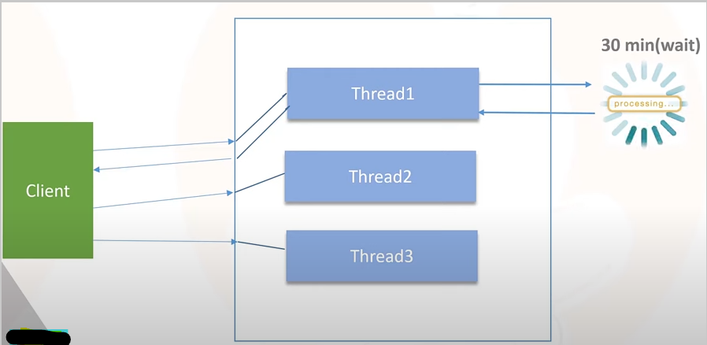
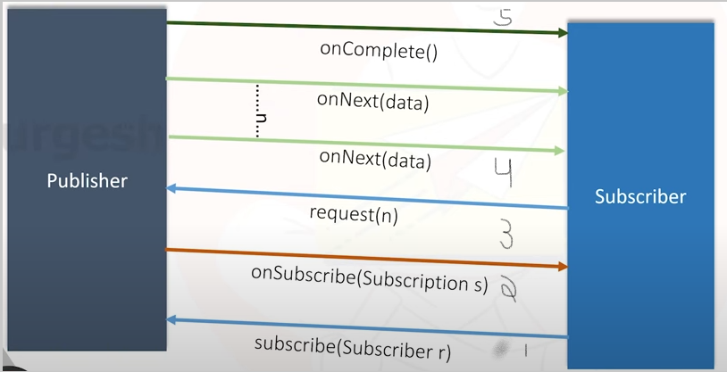

# Reactive Programming

## What is reactive programming

- is a design pattern that focus on asynchronous and non-blocking data streams to handle events and data

## Synchronous and Blocking

Client request for some resource. That will be handled by a thread. Suppose it will take 30 minute to get the resource(I/O or DB).
Thread will do nothing and waiting for it to get the resource. After receiving the response thread will send it to client. This is synchronous and blocking.

Still we can see multithreading as multiple threads are performing different tasks but because of individual threads are blocking this will degrade the performance.

As we have limited number of threads available in thread pool synchronous and blocking will cause major performance issue.

## Asynchronous and non-blocking: 

Thread won't wait. ex - waiter in hotel takes order and gives the order to chef. During the order preparation waiter don't wait for order to be completed and continue taking other orders.
As soon as order completed it will get the notification from chef and he will serve the order.

Helps us to increase the efficiency and scalability of application.

## Features of Reactive Programming

- Asynchronous and non-blocking
- Functional style coding using lamda
- Data flow as event driven.
- Backpressure of data stream. ex - if receiver is not able to consumer teh number of message send by sender then we can set backpressure to get only limited amount of data

## Reactive stream specification

- Reactive programming has some rules
- There are 4 main interface

### 1 - Publisher

- Data source 
 
        public interface Publisher<T> {
            public void subscribe(Subscriber<? super T> s);
        }
- This method is called by subscriber for the subscription by providing the subscriber reference

### 2 - Subscriber

- Receiver 

        public interface Subscriber<T> {
            public void onSubscribe(Subscription s);
            public void onNext(T t);
            public void onError(Throwable t);
            public void onComplete();
        }
- Data will be provided by publisher
- When subscriber subscribe publisher, then publisher will send notification that subscription is completed and that time onSubscribe() method will be called by publisher and publisher will give subscription object
- When data is published by publisher, publisher will call onNext every time it will publish. Data will be received using this
- If error during communication then onError will be called
- if everything is completed then onComplete() will be called

### 3 - Subscription

- When subscriber call publisher and when publisher will call onSubscribe() method then we get Subscription object
- Using this object we can request publisher to send n number of data (to handle backpressure) or to cancel the subscription

        public interface Subscription {
            public void request(long n);
            public void cancel();
        }

### 4 - Processor

- it can represent both publisher and subscriber

        public interface Processor<T, R> extends Subscriber<T>, Publisher<R>{
        }

## Pub Sub Event Flow

- Subscriber will subscribe the publisher by calling the subscribe method and send the reference
- When subscription is completed publisher will call onSubscribe method and send the subscription object
- Using the subscription object, subscriber will request n data from publisher
- publisher will call onNext method n time and send data

